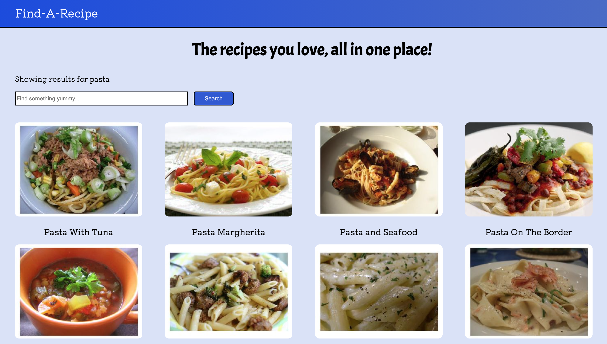

#Find-A-Recipe

## `Description:`

This is a recipe website that allows users to easily find recipes through a search bar and give them easy to read and understand recipes with step by step instructions on how to make delicious recipes. This project is a single page application built using React and an API.


## `Technologies Used:`
```
- React
- JavaScript
- HTML
- CSS
- API
```


## `Getting Started:`

Wonderfully easy site to use. Just click on this link [Find-A-Recipe](https://drew-e-wilson.github.io/find-a-recipe/). Then use the search bar to find new recipes you'll love. Trying search for Cookies, Roast or Pasta! Next click on the picture of any food that looks good to find the recipe and enjoy making yourself. 


## `Contribute:`

Feel free to fork this repo, edit, change it and make it your own! OR if you find and bugs or problems, feel free to initiate an [Issue](https://github.com/Drew-E-Wilson/find-a-recipe/issues) and I'll fix it. Thanks for looking and helping out! 

### `Stretch Goals:`

- [ ] Fix ingridients list
- [ ] Get Cooking Instructions in ordered list format
- [ ] Create a Grocery List Page
- [ ] Search Recipes by ingredients list
